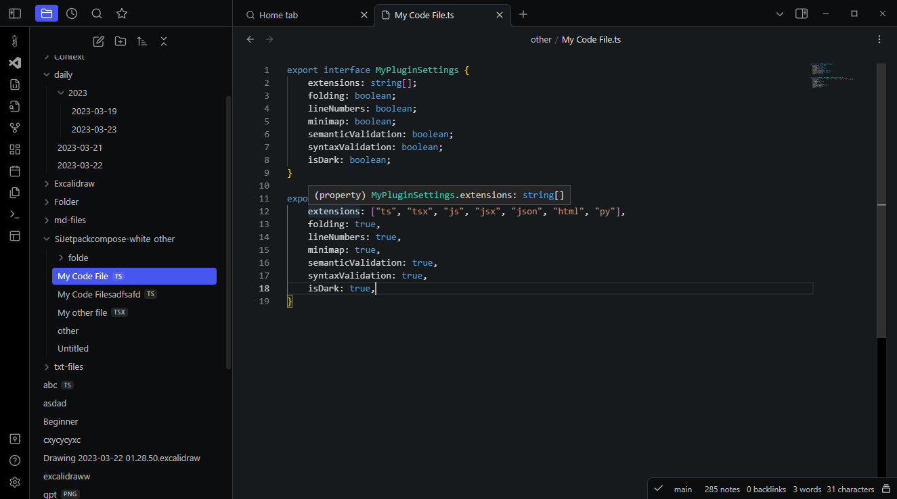
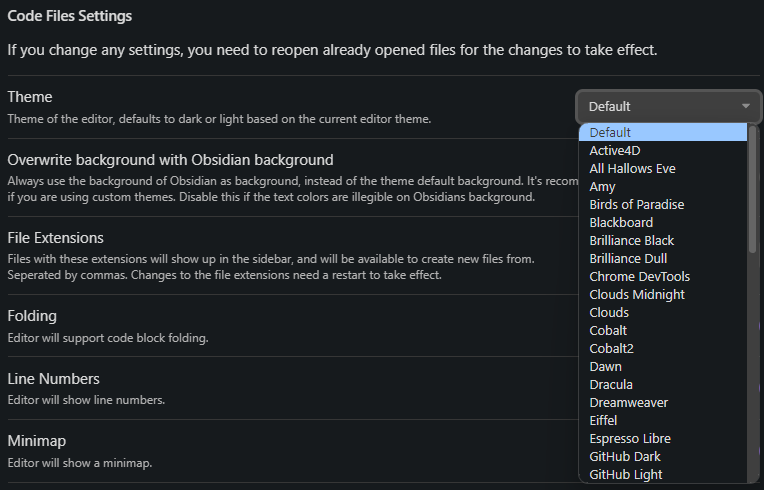
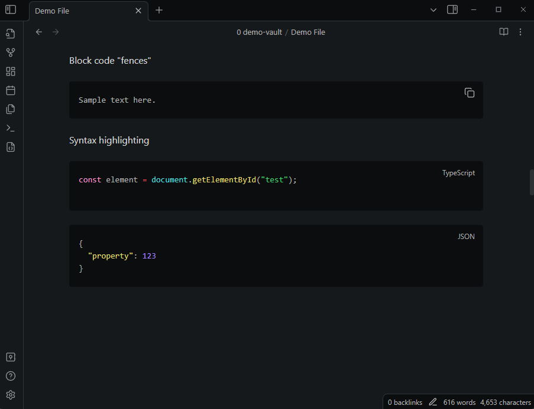
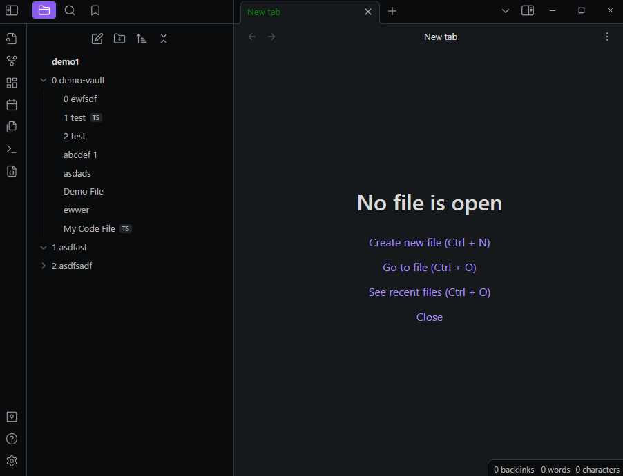
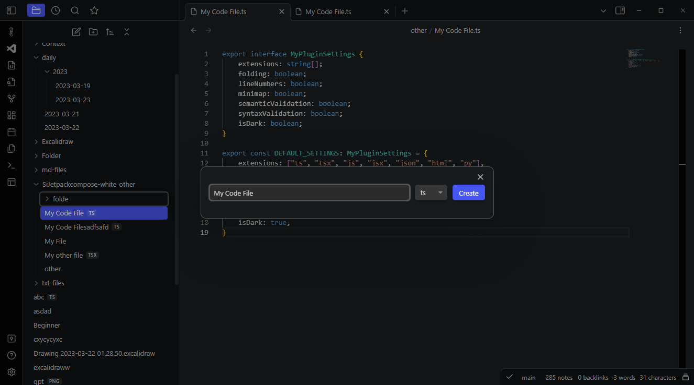
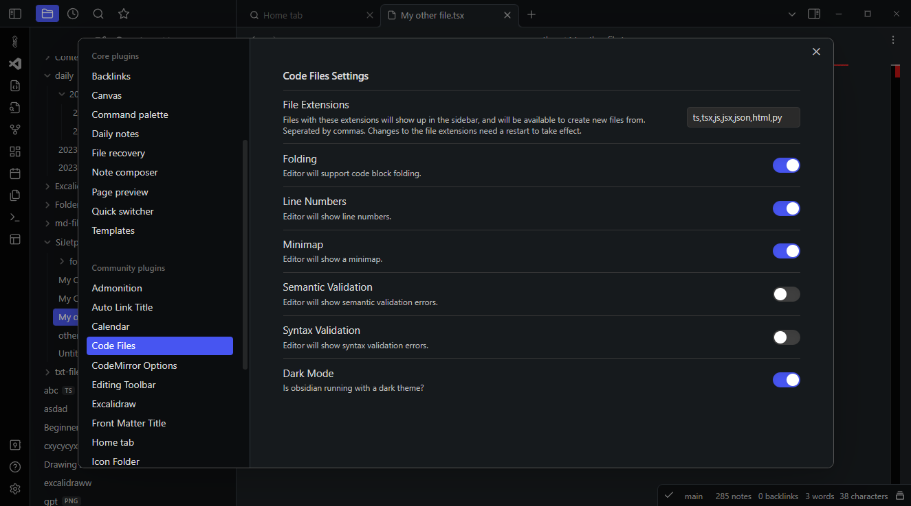

# Obsidian Code Files

> Plugin for ObsidianMD to show and edit code files along other notes.

The plugin adds a code editor view to Obsidian. The code editor uses the powerful
[Monaco Editor](https://microsoft.github.io/monaco-editor/), which also powers VS Code.

*__🚀 New Feature: The plugin now also supports editing individual code blocks from Markdown
files in an embedded Monaco Editor instance. Read [below](#new-feature-code-block-editing).__*

**Caveat: This plugin currently relies on hosted dependencies and thus needs an internet connection.
Read [below](#caveat-online-dependency) for more information.**

In the plugin settings, you can configure for which file extensions the editor will be
available as default editor. You can also create new code files, either by right clicking
on a folder in the side pane and clicking on "Create Code File", search for
"Create new Code File" in the command palette or by using the "Create Code File" button
in the ribbon.

## New feature: Themes

Besides the default themes that ship with VSCode, the plugin also supports a long list
of custom well-established themes to choose from.

## Code Block Editing

The plugin also supports editing individual code blocks from any
Markdown document in the editor. You
can either invoke the command palette and search for "Open Current Code Block in Monaco
Editor", or right click on any code block and click on "Edit Code Block in Monaco Editor".

This will open a new modal with a Monaco Editor instance in which you can edit the code
block, which will automatically sync back to the block in your document when you close
the modal.

## Editing CSS Snippets

Search for the command "Edit CSS Snippet" to search CSS Snippets that exist in your
Obsidian vault and edit them in the Monaco Editor.

## More Screenshots

## Caveat: Online dependency

Due to the complicated nature of bundling the Monaco Editor, the plugin currently relies on
a hosted version of the editor. This means that the plugin needs an internet connection to
work, and has a dependency on the hosted editor, which is currently available on
https://embeddable-monaco.lukasbach.com.

I hope to remove this dependency in the future, but this was the easiest way to get the
plugin to work for now.
